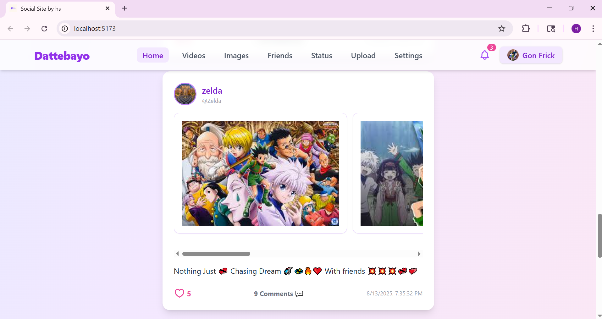
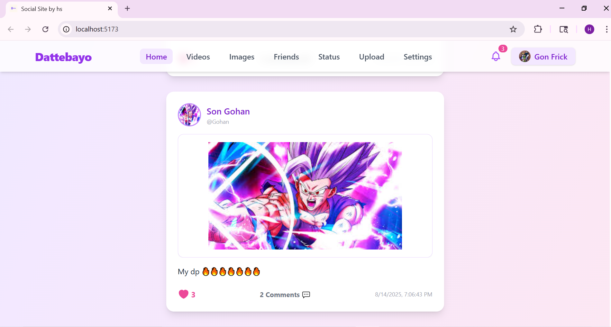
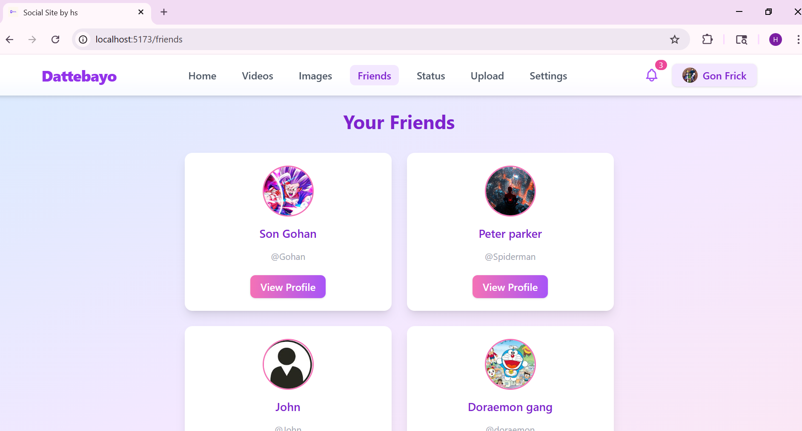
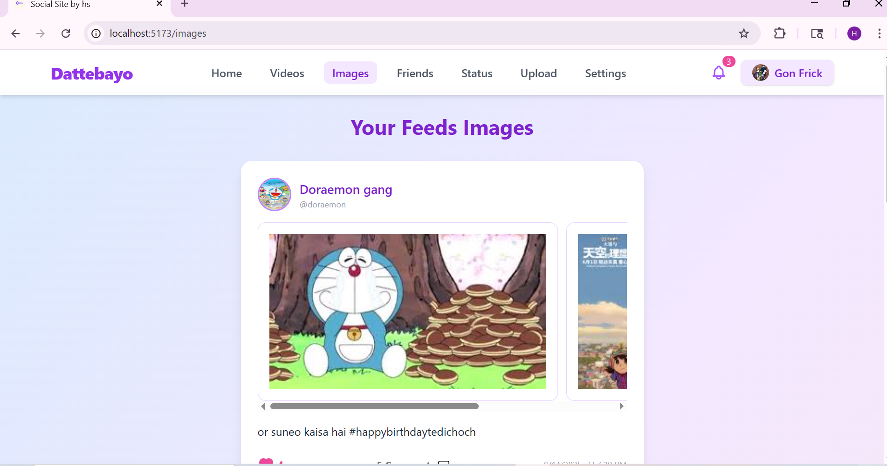

# 🌌 YaroVerse – Social Media Platform  

Welcome to **YaroVerse** – a vibrant, modern social media universe for connecting, sharing, and engaging! 🚀  
Built with a **Django REST** backend and a **React + Redux + Tailwind CSS** frontend, YaroVerse offers a smooth, responsive, and visually stunning social experience. ✨  

---

## 🛠 Tech Stack  

**Frontend:**  
- ⚛️ React + Redux Toolkit  
- 🎨 Tailwind CSS  
- ⚡ Vite  

**Backend:**  
- 🐍 Django REST Framework  
- 🗄  SQL  
- 🔒 JWT Authentication  

---

## ✨ Features  

- 🏠 **Home Feed:** Scroll through posts, images, and videos from friends.  
- ❤️ **Like & Comment:** React and interact in real-time.  
- 👤 **User Profiles:** Avatars, bios, and personalized feeds.  
- 👫 **Friends List:** Connect, follow, and explore other users.  
- 📸 **Upload Moments:** Share your photos and videos with ease.  
- 💬 **Comment System:** Add, view, and delete comments with avatars.  
- 🧭 **Status System:** Add, view, and delete with avatars of friends.  
- 🔒 **Authentication:** Secure login & registration.  
- ⚙️ **User Settings:** Personalize your profile and privacy.  
- 🎨 **Aesthetic UI:** Youthful, colorful, and responsive for all devices.  
- ⚙️ **Admin Settings:** Full control over the site User ,Posts , Comments ,Status ,Like and much more.  

---

## 🚀 Getting Started  

### 📌 Prerequisites  
- Node.js & npm  
- Python 3.10+  
- PostgreSQL  

---
## 📸 Screenshots

### Home Feed

### User Profile

### Friends 

### Status 

### Feed with Comments

> Made with 💜 by Himanshu